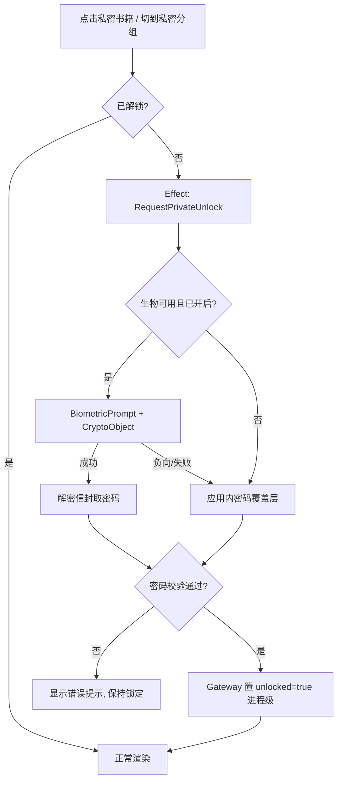

## 用户需求（原始）

利用应用已有的**本地密码字段**与 **Android 生物验证 API**，为书架实现「私密分组 / 私密书籍」：书籍封面与文字信息在未验证时
**模糊脱敏**；点击时**请求验证**；当**书架当前分组为私密分组时整页不显示内容**并同时触发验证；未验证状态给出明确提示；尽量
**复用已有组件**。

## 澄清后确认的边界

- **凭据组合**：本地密码是权威凭据；生物验证只是"免手输"的快捷方式；**未设置本地密码则私密功能不可用**
  ，引导去设置页先设置密码。
- **解锁有效期**：一次启动仅验证一次（进入私密书籍或私密分组时触发），**进程重启后失效**；不做超时、不做切后台重锁。
- **私密判定**：`所属私密分组` ∪ `单本独立标记`，取并集（需为书籍新增字段）。
- **覆盖范围**：书架（分组页 + 书籍项）、书籍详情页/简介页、设置与分组管理。**不含**
  发现页/搜索页（但书架内搜索不得泄漏私密书名）。

## 产品概述

在书架中，私密内容以两种锁定形态呈现：私密分组整页替换为"已隐藏 + 点击验证"
占位；私密书籍仍占位显示，但封面模糊、书名/作者/简介/章节等信息替换为掩码并带锁标。点击任一锁定内容弹出生物验证（可用时），负向按钮回退到应用内密码输入。验证通过后本次进程内所有私密内容正常渲染。

## 核心功能

- 私密标记：分组编辑复用已有"设为私密分组"开关；书籍新增"设为私密"入口（书架编辑态 / 书籍详情菜单）。
- 脱敏渲染：封面走全 API 生效的模糊变换，文本全部替换为掩码，不渲染真实书名、作者、简介、最新章节、未读数、标签。
- 验证入口：点击脱敏书籍卡片、打开私密书籍详情、切换到私密分组页时触发。
- 未验证提示：锁定态内置"该内容已隐藏，点击验证后查看"文案与锁标；验证失败给出错误提示。
- 设置：新增"私密功能"分组（生物快捷解锁开关、修改密码入口、无密码时的引导）。
- 泄漏边界：书架内搜索不匹配私密书籍字段，命中也仅以脱敏卡片呈现。

## 技术栈

- 现有栈：Kotlin + Jetpack Compose + Material 3 + Navigation 3 + Koin + Room + DataStore（
  `LocalPreferences`）+ Coil 3.6.3。全部沿用，不引入新架构。
- **新增依赖**：`androidx.biometric:biometric-ktx`（`gradle/libs.versions.toml` 已有
  `biometricKtx = "1.1.0"` 版本引用但**未定义 library 别名、未在 `app/build.gradle.kts` 声明**
  ，需补全）。选用稳定版 1.1.0 而非 `biometric = "1.4.0-alpha07"`。
- 加密：Android Keystore（AES/GCM，`setUserAuthenticationRequired(true)` 的 auth-per-use 密钥）+
  `PBKDF2WithHmacSHA256` 派生校验值；沿用项目 `help/crypto` 的 JCA 路线。

## 实现方案

### 1. 凭据模型：密码为主 + 生物快捷（加密绑定）

本地密码仍是唯一权威凭据。生物路径不是"回调返回 true 就解锁"（可被 hook 伪造），而是**加密绑定**：

1. Keystore 生成 `legado_private_vault` 密钥：`PURPOSE_ENCRYPT|DECRYPT`、`BLOCK_MODE_GCM`、
   `ENCRYPTION_PADDING_NONE`、`setUserAuthenticationRequired(true)`、
   `setInvalidatedByBiometricEnrollment(true)`（默认即 true）。
2. 设置/修改密码时，用该密钥把密码封装成"信封"（AES-GCM 密文 + IV）存 DataStore。
3. 解锁时 `BiometricPrompt.authenticate(promptInfo, CryptoObject(cipher))`，
   `onAuthenticationSucceeded` 后从 `result.cryptoObject?.cipher` 解密信封取得密码 → 解锁。*
   *解密成功才等价于密码正确**。

该设计规避了官方两条硬约束：允许 `DEVICE_CREDENTIAL` 时不能传 `CryptoObject`；本设计**不需要**
`DEVICE_CREDENTIAL` 回退（应用内密码就是回退），因此可只用 `BIOMETRIC_STRONG` + `CryptoObject`。

必须处理的平台状态（显式建模，不做静默空实现）：

- `BiometricManager.canAuthenticate(BIOMETRIC_STRONG)` →
  `ERROR_NONE_ENROLLED / ERROR_NO_HARDWARE / ERROR_HW_UNAVAILABLE` → 直接回落密码输入，并在设置项显示不可用原因。
- `KeyPermanentlyInvalidatedException`（新增指纹后密钥失效）→ 清信封、回落密码、验证成功后重建信封。
- 只允许 `BIOMETRIC_STRONG` 时**必须**调用 `setNegativeButtonText("使用密码")`（不能同时用
  `setAllowedAuthenticators(... or DEVICE_CREDENTIAL)`）。

### 2. 密码校验

不新增明文比对。新增 DataStore key：`private_salt`、`private_verifier`（PBKDF2WithHmacSHA256，salt 16B
随机，迭代 ≥ 210000，输出 32B）、`private_biometric_envelope`、`private_biometric_iv`、
`private_biometric_enabled`。`LocalPasswordGateway.setPassword` 时**原子更新** salt/verifier/信封（一次
`putAllAndAwait`），保证密码与信封永不同步失败。

### 3. 脱敏渲染（关键：不能只用 `Modifier.blur`）

项目 `minSdk 26`，而 `androidx.compose.ui.draw.blur` 在 **API < 31 为 no-op**（项目已在
`CoverBlurBackdrop.kt` 使用）→ 单独依赖会**在 26–30 直接泄漏真实封面**。

方案：统一使用 **Coil `Transformation`**（已确认 API：`coil3.transform.Transformation`，
`override val cacheKey: String`，`override suspend fun transform(input: Bitmap, size: Size): Bitmap`
，先例见 `MangaCoilTransformations.kt`），做「降采样 → box blur ×2 → 放大」，全 API 一致生效、结果确定；锁定态请求使用独立
`memoryCacheKey`，不污染正常封面缓存。文本一律替换为掩码，**不渲染真实字符串**。

### 4. 数据层

- `Book` 新增 `@ColumnInfo(defaultValue = "0") var isPrivate: Boolean = false`；`AppDatabase`
  `version 106 → 107`（`exportSchema = true`，简单加列走 `AutoMigration(from = 106, to = 107)`，落库前用生成的
  schema diff 复核）。
- `BookShelfItem` 投影新增一列，SQL 直接算并集：
  `(books.isPrivate = 1 OR (books."group" & PRIVATE_GROUP_MASK) <> 0) AS isPrivate`（复用 `BookDao`
  已有 `PRIVATE_GROUP_MASK`，不新增语义常量）。
- **语义决策（需明确）**：`Book.isPrivate` **不并入** `PUBLIC_BOOK_FILTER`。理由：用户要求"封面模糊 +
  点击验证"，私密书必须仍在书架可见；而"属于私密分组的书从其他视图隐藏"是 `private_group_desc` 既定语义（
  `PUBLIC_BOOK_FILTER`），保持不变。即：分组私密 = 整组隐藏；单本私密 = 隐藏内容但保留脱敏入口。
- 性能：新增的是标量子查询，`PUBLIC_BOOK_FILTER` 已在同批查询中使用，增量为一个按位与；不新增表扫描。搜索过滤在内存侧对已加载列表做，不额外查库。

### 5. 解锁态与 UDF 接入

`PrivateAccessRepository` 持进程内 `MutableStateFlow(false)`（进程重启即失效，符合"一次启动一次"
）。ViewModel **只订阅 `Flow<PrivateAccessState>`**，不持有 Activity、不碰 Keystore。

系统 UI（BiometricPrompt）必须由 `FragmentActivity` 承载 —— 已确认
`BaseComposeActivity : AppCompatActivity()`，`MainActivity` 满足。按 AGENTS.md「宿主动作通过 Effect
处理」：ViewModel 发 `RequestPrivateUnlock(target)` → Screen 侧 `LocalContext.current` 取得
FragmentActivity → 平台组件弹 BiometricPrompt；负向按钮或不可用时改为展示应用内密码覆盖层（
`AppAlertDialog` + `AppTextField`，复用现有组件）→ `onIntent(SubmitPrivatePassword)` → Gateway 校验 →
成功后执行挂起动作（打开书籍 / 解锁当前分组）。



## 实施要点（防回归）

- **不在 UI/ViewModel 新增 DAO 直连**：私密读写全部走 `PrivateContentGateway`（data 层 Repository
  实现），保持 `verifyConfigArchitecture` 基线不上升。
- **Koin 显式绑定** Gateway 接口 → Repository 实现（不用构造函数绑定掩盖归属）。
- 锁定态不得预取/预渲染真实数据：私密分组整页占位时，仍会加载列表（SQL 放行）但**不把真实字符串交给
  Composition**，由脱敏组件统一替换。
- 新增 `@Stable`：所有新 UiState / UI item 字段；集合用 `kotlinx.collections.immutable`。
- 文案进 `strings.xml`（中/英都要），不硬编码。
- 备份/恢复（`Backup.kt`/`Restore.kt`/`RestoreConfigNormalizer.kt`）需确认 `Book.isPrivate` 新列是否被
  Gson 序列化带入导出 JSON，避免旧版本恢复报错。
- 日志：不打印书名、密码、信封；失败只记错误类型。

## 架构设计

```text
Compose UI (BookshelfScreen / BookInfoScreen / OtherConfigScreen)
    ↓ Intent
ViewModel (BookshelfViewModel / BookInfoViewModel)   ← 只订阅 Flow
    ↓ Effect (RequestPrivateUnlock)        ↓ Gateway
宿主 FragmentActivity / 平台组件            domain/gateway
    BiometricPrompt + CryptoObject         PrivateAccessGateway
    ↓                                      PrivateContentGateway
    PrivateAccessRepository ──────────────→ data/repository (Room OK)
    PrivatePasswordCipher (Keystore/PBKDF2)
```

平台能力不可用时显式建模为
`PrivateBiometricStatus { Available, NotEnrolled, NoHardware, Unavailable, Disabled }`，不伪造支持。

## 目录结构

```
app/src/main/java/io/legado/app/
├── domain/
│   ├── model/PrivateAccess.kt                     # [NEW] @Stable PrivateAccessState(isUnlocked, hasPassword, biometricStatus, biometricEnabled)；enum PrivateBiometricStatus；@Stable PrivateUnlockTarget（Book(bookUrl)/Group(groupId)/Detail(bookUrl)）
│   └── gateway/
│       ├── PrivateAccessGateway.kt                # [NEW] 解锁态与凭据：state Flow、verifyPassword、setBiometricShortcutEnabled、setPassword
│       └── PrivateContentGateway.kt               # [NEW] 私密内容读写：isBookPrivate(bookUrl)、setBooksPrivate(bookUrls, isPrivate)、flowPrivateGroupIds()
├── data/
│   ├── entities/Book.kt                           # [MODIFY] 新增 isPrivate 列（defaultValue 0）
│   ├── dao/BookDao.kt                             # [MODIFY] 投影新增并集 isPrivate 列；新增按 isPrivate 过滤/更新的查询
│   ├── AppDatabase.kt                             # [MODIFY] version 106→107 + AutoMigration(106,107)
│   ├── local/preferences/LocalPreferences.kt      # [MODIFY] 新增 salt/verifier/envelope/iv/biometricEnabled keys
│   └── repository/
│       ├── PrivateAccessRepository.kt             # [NEW] 进程级解锁态 + 密码校验 + 信封生命周期
│       └── PrivateContentRepository.kt            # [NEW] 私密书籍标记与查询（数据层，可访问 DAO）
├── help/security/
│   ├── PrivatePasswordCipher.kt                   # [NEW] PBKDF2 verifier + Keystore auth-bound 密钥 + AES-GCM 信封加解密；处理 KeyPermanentlyInvalidatedException
│   └── BiometricUnlockLauncher.kt                 # [NEW] 包装 BiometricManager.canAuthenticate + BiometricPrompt(FragmentActivity, CryptoObject)
├── ui/widget/components/private/
│   ├── PrivateCoverBlurTransformation.kt          # [NEW] Coil Transformation：降采样+box blur，全 API 生效
│   └── PrivateLockedContent.kt                    # [NEW] 可复用锁定态组件：PrivateLockedPage（整页）、PrivateLockedBookCard（脱敏卡片）、PrivateLockBadge
├── ui/main/bookshelf/
│   ├── BookShelfItem.kt                           # [MODIFY] DTO 新增 isPrivate；BookUiItem 透出
│   ├── BookshelfUiState.kt                        # [MODIFY] 新增 privateAccess、isCurrentGroupPrivate、Overlay.PrivateUnlock、Intent/Effect 解锁相关
│   ├── BookshelfViewModel.kt                      # [MODIFY] 订阅 PrivateAccessGateway；组合私密态；挂起动作；搜索过滤私密书
│   ├── BookshelfScreen.kt                         # [MODIFY] 整页锁定分支、Effect 宿主分发、密码覆盖层
│   └── BookItem.kt                                # [MODIFY] BookItem/BookGroupItem* 在锁定态走脱敏渲染（复用 BookshelfGridItem/ListItem 骨架）
├── ui/book/info/
│   ├── BookInfoViewModel.kt                       # [MODIFY] 私密书未解锁时进入锁定态
│   └── BookInfoScreen.kt                          # [MODIFY] 复用 PrivateLockedPage + 验证入口
├── ui/config/otherConfig/
│   ├── OtherConfigContract.kt / Screen.kt / RouteScreen.kt / ViewModel.kt   # [MODIFY] 新增"私密功能"设置块：生物快捷解锁开关、未设密码引导
├── ui/book/group/GroupEditSheet.kt                # [MODIFY] 复用已有 isPrivate 开关，确认文案对齐新语义
├── di/appModule.kt                                # [MODIFY] Koin 显式绑定 Gateway→Repository
├── res/values/strings.xml                         # [MODIFY] 新增锁定/验证/设置相关文案
gradle/libs.versions.toml                          # [MODIFY] 新增 androidx-biometric library 别名
app/build.gradle.kts                               # [MODIFY] implementation(libs.androidx.biometric.ktx)
app/src/test/.../PrivateAccessRepositoryTest.kt    # [NEW] 纯逻辑单测：私密并集判定、密码校验、锁定态掩码、搜索过滤
```

## 关键代码结构

```
// domain/model/PrivateAccess.kt
@Stable
data class PrivateAccessState(
    val isUnlocked: Boolean = false,
    val hasPassword: Boolean = false,
    val biometricStatus: PrivateBiometricStatus = PrivateBiometricStatus.Unavailable,
    val biometricEnabled: Boolean = false,
)

enum class PrivateBiometricStatus { Available, NotEnrolled, NoHardware, Unavailable, Disabled }

sealed interface PrivateUnlockTarget {
    data class Book(val bookUrl: String) : PrivateUnlockTarget
    data class Group(val groupId: Long) : PrivateUnlockTarget
    data class Detail(val bookUrl: String) : PrivateUnlockTarget
}

// domain/gateway/PrivateAccessGateway.kt
interface PrivateAccessGateway {
    val state: Flow<PrivateAccessState>
    suspend fun verifyPassword(password: String): Boolean
    suspend fun setBiometricShortcutEnabled(enabled: Boolean)
    suspend fun consumeBiometricEnvelope(cipher: javax.crypto.Cipher): Boolean // 生物成功后解密信封
    fun createBiometricCipher(): javax.crypto.Cipher? // 平台下放：无可用生物/密钥失效时返回 null
}

// domain/gateway/PrivateContentGateway.kt
interface PrivateContentGateway {
    suspend fun isBookPrivate(bookUrl: String): Boolean
    suspend fun setBooksPrivate(bookUrls: Set<String>, isPrivate: Boolean)
}
```

> 注：`Cipher` 是 JVM 类型，按 AGENTS.md「共享契约不暴露平台类型」的原则，实际落地时以上两方法应下沉到平台侧接口（
`PrivateBiometricVault`，位于 `help/security`，由 `BiometricUnlockLauncher` 使用），Gateway 只保留
`state/verifyPassword/setBiometricShortcutEnabled`。实现时以这一更严格的分层为准。

## 设计风格

沿用应用现有 Material 3 Expressive + 玻璃/毛玻璃语言，**不引入新视觉体系**：锁定态使用低饱和中性表面 +
圆角卡片 + 锁形图标 + 细腻遮罩，与 `LegadoTheme.colorScheme`、`NormalCard`/`GlassCard` 保持一致。

## 页面与区块

**书架页（锁定态）**

- 顶部导航条：保持现有，仅分组名旁加小锁标，不改变布局。
- 私密分组内容区：整页居中卡片，锁图标 48dp + 主标题"该分组已隐藏" + 说明"验证后查看内容" + 主按钮"
  验证并查看"。
- 书籍脱敏卡片：复用 `BookshelfGridItem` / `BookshelfListItem`
  骨架，封面走模糊变换，书名/作者/章节替换为掩码条（圆角灰条），右下角叠加小锁标；网格与列表两种模式共用同一脱敏组件。
- 验证交互：生物可用时系统弹窗，负向按钮"使用密码"；否则应用内 `AppAlertDialog` + `AppTextField`
  。失败抖动 + 错误文案，不退出锁定态。
- 微动效：解锁成功后脱敏层以 200ms 交叉淡出到真实内容，避免闪跳。

**书籍详情页（锁定态）**

- 复用 `PrivateLockedPage`：模糊化的背景封面 + 居中锁卡片 + "验证以查看"按钮；验证通过原地过渡到详情。

**设置页**

- 新增"私密功能"分组：生物快捷解锁开关、修改密码入口、无密码时的引导行（点击进入密码设置）。

## 响应式与可达性

- 锁定态文案走 `contentDescription`，保证 TalkBack 读出"已隐藏，需验证"而非真实书名。
- 锁标与按钮触控区 ≥ 48dp；深色/浅色主题均使用主题色令牌，不硬编码。

## Agent Extensions

### Skill

- **legado-compose-review**
- 用途：审查新增/改造的 Compose 屏幕与状态宿主（Bookshelf、BookInfo、OtherConfig）是否符合 UDF/MVI、
  `@Stable`、Effect 边界与依赖方向约束。
- 预期结果：给出符合仓库门禁的 Contract/ViewModel/Screen 形态，避免在 ViewModel 层泄漏 DAO/Activity。

### SubAgent

- **code-explorer**
- 用途：在实施前精确定位 `Book` 实体全部构造点、`BookShelfItem` 投影定义、备份/恢复对 Book 字段的处理、
  `BaseComposeActivity`→`FragmentActivity` 链路、Koin 绑定位置。
- 预期结果：产出准确的修改点清单，避免遗漏导致编译或行为回归。