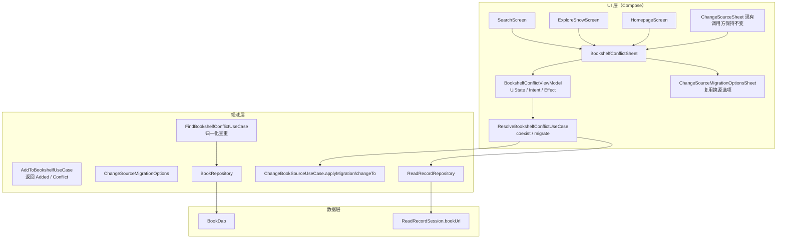

## 产品概述

在「加入书架」链路引入重名/同作者书籍的冲突检测与可视化处理。当检测到书架中已有疑似同一作品时，弹出底部
Sheet：上方展示新加入书籍信息，中部以卡片列表展示书架已有作品的封面、书名、作者名、书源名（点击可跳转到该书架作品），底部提供「共存」「迁移」两种处理方向，并支持在进入任一方向前勾选要携带的数据项。阅读记录支持按书籍副本隔离计时：共存时两本书各自累计，作品维度展示为两者之和；迁移时把旧书籍的阅读记录平移给新书籍，绝不重复累加。

## 核心功能

- 加入书架时的重名检测（覆盖搜索页、发现页、首页推荐三条路径）
- 疑似重复判定：书名规范化后相同 + 作者规范化后相同；任一方作者为空时仅按书名判定为疑似
- 冲突 Sheet：封面 + 书名 + 作者 + 书源名卡片列表，点击跳转书架已有作品
- 「共存」：新书入架（置顶排序），按勾选项从已有作品复制数据到新书
- 「迁移」：新书替换已有作品（等价于换源），按勾选项携带数据
- 可选数据项复用批量换源的换源选项：阅读进度、分组和排序、自定义封面、分类与标签、备注和自定义简介、阅读设置（共存场景隐藏「删除已下载章节」）
- 阅读时长防叠加：阅读会话归属到具体书籍副本（bookUrl），各自独立计时；迁移为平移/重建而非 sum
  合并；打开书籍时的「未知作者自动合并」加护栏

## 技术栈

沿用现有工程：Kotlin + Jetpack Compose + Material 3（`LegadoTheme`）+ Room + Koin +
StateFlow/SharedFlow + Navigation 3。新 UI 全部 Compose（不新增 XML/Fragment），复用项目现有组件
`AppModalBottomSheet`、`SelectionItemCard`、`AppText`、`CheckboxItem`、`ConfirmDismissButtonsRow`、
`MediumTonalButton`、封面加载组件，`AppText/Coil` 封面渲染沿用 `SelectionItemCard` 与 `CoverFileCache`
既有路径。

## 实施思路

### 1. 现状与痛点（已核实）

| 位置                                                               | 现状                                                               | 问题                                  |
|------------------------------------------------------------------|------------------------------------------------------------------|-------------------------------------|
| `domain/usecase/AddToBookshelfUseCase.kt`                        | 直接 `toBook()` + `insert`，无查重                                     | 同名同作者书会静默重复入架                       |
| `ui/widget/components/changeSource/ChangeSourceSheet.kt:471-541` | 已有冲突检测与 `AppAlertDialog`（纯文本、两个按钮）                               | 无封面、不能跳转原书、不能选携带数据                  |
| `domain/usecase/ChangeBookSourceUseCase.kt`                      | `ChangeSourceMigrationOptions` + `applyMigrationTo` + `changeTo` | 是「携带字段」的唯一实现，但被锁在类内私有扩展里，无法被共存/加书复用 |
| `data/entities/readRecord/ReadRecord.kt`                         | `primaryKeys = [deviceId, bookName, bookAuthor]`                 | 同名同作者必然共用一行 → 时长叠加根因                |
| `ReadRecordRepository.updateReadRecord:217`                      | `existing.readTime + durationDelta` 累加                           | 只有同一会话被重复写入或两行被 sum 合并时才会翻倍         |

### 2. 关键决策与取舍

**决策一：阅读时长以「会话（Session）」为权威账本，按书籍副本归属**

- `readRecordSession` 的 PK 是自增 id，**加列不需重建主键**（只需 `ALTER TABLE ADD COLUMN` +
  建索引），是三张表里唯一零破坏性改写点；仓库注释已明确「以阅读时段记录为权威重建汇总与每日明细」，与该设计天然一致。
- 由此派生出两个口径：**单本时长 = 该书 `bookUrl` 的会话求和**；**作品时长（readRecord /
  readRecordDetail）= 该书名下所有会话求和**。这正好同时满足「各自独立计时」和「作品维度展示为两者之和」，且不需要改
  `readRecord` / `readRecordDetail` 的主键，避免波及 `Restore`、`BackupConfig`、`ReadRecordViewModel`
  等大量既有调用。
- 取舍：书名+作者维度的每日明细仍按作品聚合，不在 Scripture 上再拆副本列；后续若有「分副本日历」需求再增列为宜。

**决策二：迁移时「平移 + 由会话重建」，禁用 sum 合并**

- 已有 `mergeIndependentReadRecordsInto` 是 sum 语义，用于「合并两条互不重叠的历史记录」；把它用在迁移上会导致同一段历史被计两次。
- 迁移改为：`updateSession(bookUrl: old → new)` 平移会话（幂等），再走 `updateReadRecordTotal`
  （由会话重算 + 保留 legacy 时长）重建汇总/明细。
- 若迁移后书名/作者发生变化，复用现有 `mergeIndependentReadRecordsInto` 对**(name, author) 键**
  做重挂（此时两条键确实代表不同历史，非重叠），避免旧记录成为孤儿。

**决策三：共享契约 + 共享 Sheet，外部签名保持不变**

- `ChangeSourceMigrationOptions` 提升为迁移/共存共用的配置类型（移至独立文件，**包与类名不变**
  ），三种场景共用一份 UI（`ChangeSourceMigrationOptionsSheet`）与一份选项解析逻辑。
- `ChangeSourceSheet` 现有的 5 个调用方（`BookInfoScreen:474`、`BookshelfManageScreen:778/844`、
  `ReadBookScreen:677`、`MangaReaderScreen:316`）签名一律不改，只把内部旧 AlertDialog 换成共享 Sheet。
- `ChangeBookSourceUseCase` 内部私有扩展 `Book.applyMigrationTo` 提取为共享扩展，供共存/迁移/批量换源复用；
  `changeTo` 保持对外行为不变（删旧插新 + `BookHelp.updateCacheFolder` +
  `ReadBook.onChapterListUpdated`）。

**决策四：冲突处理的 UI 状态宿主复用既有 Compose ViewModel 模式**

- 参照 `ChangeBookSourceComposeViewModel`（同一 emitter 模式：私有 `MutableStateFlow` + 单一
  `onIntent` + `MutableSharedFlow` 效果），新建独立的 `BookshelfConflictViewModel`，由共享 Sheet 通过
  `koinViewModel(key = "conflict-${newBook.bookUrl}")` 持有。三个宿主 ViewModel 只需多转发一个
  Effect/Intent，不复制状态机。

### 3. 架构设计



### 4. 目录结构

```text
app/src/main/java/io/legado/app/
├── data/
│   ├── AppDatabase.kt                                   # [MODIFY] version 105 → 106，新增 AutoMigration(105→106)
│   ├── DatabaseMigrations.kt                            # [MODIFY] 会话表加列/建索引；可复用 L429 的表重建写法
│   ├── entities/readRecord/ReadRecordSession.kt         # [MODIFY] 新增 bookUrl 列 + owner 索引，并入 stableFingerprint 以外的查询身份
│   ├── dao/ReadRecordDao.kt                             # [MODIFY] 新增按 bookUrl 查询/按所属书籍统计、平移会话的 DAO 方法
│   ├── repository/ReadRecordRepository.kt               # [MODIFY] saveReadSession 带 bookUrl；新增 reassignSessions/rebuild；调整 getLatestReadRecords 等聚合口径
│   ├── repository/BookRepository.kt                     # [MODIFY] 新增按书名查询（走索引），给查重用例提供候选集
│   └── dao/BookDao.kt                                   # [MODIFY] 新增 name 索引与按名查询
├── model/ReadBook.kt                                    # [MODIFY] L850/L927/L955 构造与保存会话时携带 currentBook.bookUrl
├── data/repository/manga/MangaReaderDataRepository.kt   # [MODIFY] L200 会话写入携带 bookUrl
├── domain/
│   ├── model/BookshelfConflict.kt                       # [NEW] @Stable 冲突模型：ConflictBookSummary / BookshelfConflict
│   ├── usecase/BookMigrationOptions.kt                  # [NEW] 从 ChangeBookSourceUseCase.kt 移出 ChangeSourceMigrationOptions，全限定名不变
│   ├── usecase/FindBookshelfConflictUseCase.kt          # [NEW] 归一化查重（复用 ReadRecordIdentity），返回候选列表
│   ├── usecase/ResolveBookshelfConflictUseCase.kt       # [NEW] coexist / migrate 两个方向 + 阅读记录平移
│   ├── usecase/AddToBookshelfUseCase.kt                 # [MODIFY] 返回 sealed result（Added / Conflict）
│   ├── usecase/ChangeBookSourceUseCase.kt               # [MODIFY] 私有 applyMigrationTo 提取为共享扩展；changeTo 内增加会话平移钩子（对外签名不变）
│   └── repository/...                                   # [不改动]
├── ui/
│   ├── widget/components/conflict/
│   │   ├── BookshelfConflictSheet.kt                    # [NEW] 共享冲突 Sheet：封面/书名/作者/书源卡片 + 共存/迁移 + 选项入口 + 跳转
│   │   └── BookshelfConflictViewModel.kt                # [NEW] UDF/MVI 状态宿主（继承 ViewModel，单 onIntent，Effect 走 SharedFlow）
│   ├── widget/components/changeSource/ChangeSourceSheet.kt           # [MODIFY] 旧 AppAlertDialog(L471-541) 替换为共享 Sheet
│   ├── book/changesource/ChangeSourceMigrationOptionsSheet.kt        # [MODIFY] 可选是否展示「删除已下载章节」
│   ├── book/search/{SearchViewModel,SearchScreen,SearchContract}.kt  # [MODIFY] Effect + 渲染 Sheet + 跳转书架作品
│   ├── book/explore/{ExploreShowViewModel,ExploreShowScreen}.kt      # [MODIFY] 同上
│   └── main/homepage/{HomepageViewModel,HomepageScreen}.kt           # [MODIFY] 同上
├── ui/book/read/ReadRecordAliasDelegate.kt              # [MODIFY] 护栏：同 (name, author) 存在多本时才要求用户确认，不自动合并
└── res/values/strings.xml                               # [MODIFY] 新增冲突 Sheet 文案
```

## 关键代码结构

```
// domain/model/BookshelfConflict.kt
@Stable
data class ConflictBookSummary(
    val bookUrl: String,
    val name: String,
    val author: String,
    val coverUrl: String?,
    val customCoverUrl: String?,
    val sourceName: String,      // originName 回退 origin
    val totalChapterNum: Int,
    val latestChapterTitle: String?,
)

@Stable
data class BookshelfConflict(
    val incoming: ConflictBookSummary,
    val candidates: ImmutableList<ConflictBookSummary>,
)

// domain/usecase/AddToBookshelfUseCase.kt
sealed interface AddToBookshelfResult {
    data object Added : AddToBookshelfResult
    data class Conflict(val conflict: BookshelfConflict) : AddToBookshelfResult
}

// domain/usecase/ResolveBookshelfConflictUseCase.kt
class ResolveBookshelfConflictUseCase(...) {
    /** 共存：按 options 把已有作品的字段复制到新书，新书以最小 order 入架；阅读时长不复制。 */
    suspend fun coexist(existingBookUrl: String, newBook: Book, options: ChangeSourceMigrationOptions): Result

    /** 迁移：等价于换源（删旧插新），并把旧书的阅读会话平移到新书后由会话重建汇总。 */
    suspend fun migrate(existingBookUrl: String, newBook: Book, chapters: List<BookChapter>, options: ChangeSourceMigrationOptions): Result
}
```

## 实施要点（防回归）

- **性能**：查重走 `BookDao` 的 name 索引（先按书名拉候选，再用 `ReadRecordIdentity`
  在内存中折叠空白后比对），避免全表扫描；多候选时按 `durChapterTime` 倒序。
- **一致性**：共存/迁移/会话平移必须在 `AppDatabase.withTransaction` 内完成（`changeTo`
  已有事务，会话平移需并入同一事务或紧邻其后并保证失败回滚）。
- **文案与降级**：`ChangeSourceMigrationOptionsSheet` 新增 `showDeleteDownloaded: Boolean = true`
  ，共存场景传 false，其余调用方默认行为不变。
- **日志**：沿用 `AppLog.put`（参考 ChangeSourceSheet L208 的写法），不打印正文与完整 bson/JSON。
- **兼容性**：`ChangeSourceMigrationOptions` 只搬家不改字段，旧偏好/导入导出格式不受影响；
  `readRecordSession.bookUrl` 默认空串，历史会话视为「未归属」，按作品聚合口径参与统计（保证旧时长不丢）。
- **边界**：看书 Tip `showAddToShelfAlert`（`OtherSettings.showAddToShelfAlert`
  ）保持现有语义不变，不在此次改动中重定义；本地导入、URL 批量导入（`AddBookUseCase`
  ）按用户确认范围本次不接入，仅保留其静默迁移行为作为对照。
- **验证**：`.\gradlew.bat :app:compileAppDebugKotlin`；
  `.\gradlew.bat testAppDebugUnitTest lintAppDebug verifyConfigArchitecture assembleAppDebug --continue --no-configuration-cache`
  ；文本改动 `git diff --check`。需覆盖的场景：同名同作者共存后两书独立计时且作品维度为和、迁移后总时长不翻倍、迁移后书名变化时记录不孤立、展厅机组不少于
  1 本时不自动合并未知作者记录。

## Agent Extensions

### Skill

- **lsp-code-analysis**
- Purpose：改造 `readRecordSession` 前，用调用层级/引用分析确认 `saveReadSession`、`updateReadRecord`、
  `ReadRecordDao` 会话相关查询的全部读写路径，评估加列的爆炸半径。
- Expected outcome：输出完整的读写清单（含 Restore / BackupConfig / 备份恢复果树），作为迁移影响面证据。

### SubAgent

- **code-explorer**
- Purpose：确认 `AddToBookshelfUseCase` 三个调用 ViewModel 的现有 Effect/Intent 结构、
  `SearchIntent.OpenBookshelfBook` 的导航实现，以及 `Book.applyMigrationTo` 提取为共享扩展后的所有潜在重复实现。
- Expected outcome：给出接线点清单与可复用的既有导航/老状态发放机制，避免引入平行实现。